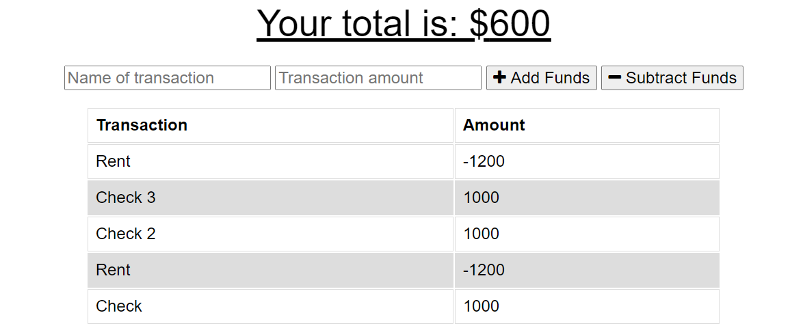
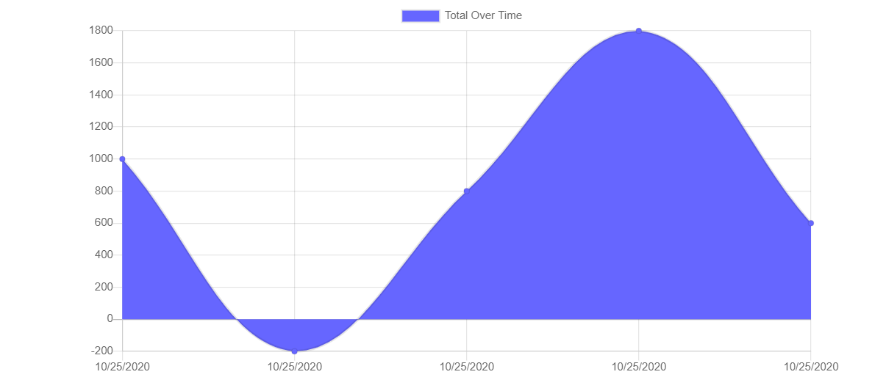

# Budget-Buddy.

  

   

For the financially conscious user, the Budget-Buddy application is designed and targeted to help with budgeting whether the user is online or offline.  It is a useful tool that lets the user track and see their budget any time they need to.  

   

## Table of Contents

~[Installation](#installation)
~[Usage](#usage)
~[Contributing](#contributing)
~[Features](#features)
~[Tests](#tests)
~[License](#license)
~[Questions](#questions)

   

## Installation

  

  
  **To edit/use the application, please follow the steps to pull the repository from GitHub through Git Bash and pull the script into VSCode, provided all three items are already installed on a local network.  It also requires Node.JS to be installed on the local network**

Instillation steps are as follows:

1. Access the repository at [Git Hub] https://github.com/Napica/HW-13-Budget-Buddy.
2. Click on the code section (in green) and clone the SSH key.
3. Once the SSH key is cloned, open the terminal through Git Bash.
4. Find or create the folder the user wants to work in and enter the following commands the the Git terminal:
   1. git clone [copied link] (_this will allow access the repository to the local computer._)
   2. git pull (_this will pull all the lines of script from the local repository._)
   3. code . (_This will extract the code and link the paths to VSCode for review/editing/uploading_)
5. In the the terminal, please run "npm install" (as the dependencie should be there) to download the modules necessary for this project to work.  
6.  Connect the local database with MongoDB atlas (user must have this set up as it is not provided)
7.  Once the modules are downloaded and the database is connected, please open up the terminal again and run "npm start". 

Please click on the link below to be redirected to the live application:

1. https://budget-buddy-buddy.herokuapp.com/

   
   
  
  ## Usage 
  
  

  
   
  
 This application to collect and analyze the user's budget over time.  It is also desiged as a PWA application that can collect data offline and,when online, update the database.  
     
     

  ## Contributing 
  
  

  
  #### Contributors 
  
I would like to thank my classmates/TA/Tutor/Instructor in helping guide the creation of this application.  I would also like to thank Alex Flemming who helped trouble shoot the deployment of this application.  
  
   
  
  ## Features
  

  Welcome to the site!

 

### The initial view of the application.  This allows the user to create a new items for increasing or decreasing the over all budget. 

  

 

### Once there is a collection of the user's budget, the appilication will display an interactive graph of the over all budget.

#### 

    

## Tests

  

  
  
  If you would like to go about testing this project, please install the project on a local server for testing.   

   
  
  ## License 
  
  

  
  This application is licensed under MIT

   

## Questions

  

  
  #### If you would like to know more, please contact or see any other projects at [napica](https://github.com/napica)